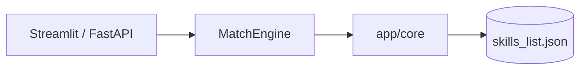

# 🎯 ResumeMatch AI

[](https://github.com/dondolo2/AI-resume-analyzer/actions/workflows/ci.yml)
[](https://codecov.io/gh/dondolo2/AI-resume-analyzer)
[](https://www.python.org/downloads/)
[](https://opensource.org/licenses/MIT)

## 🚀 Live Demo

[](https://ai-resume-analyzer-7x.streamlit.app/)

## 📸 Screenshots

| Single match | Strength radar |
|--------------|----------------|
| Match score, skill bar chart, ATS & keyword tips | 4-dimension Plotly radar + PDF export |

| Batch ranking | Resume comparison |
|---------------|-------------------|
| Leaderboard for many candidates | Side-by-side TF-IDF similarity |

_Add your own screenshots after deploying to Streamlit Cloud._

## 🎯 What It Does

ResumeMatch AI helps job seekers and recruiters quantify how well a resume fits a role. Upload a PDF or DOCX resume, paste a job description, and get an instant **match score**, **skill gap analysis**, **ATS simulation**, **strength breakdown**, and **actionable feedback**—backed by spaCy NLP, scikit-learn, and a production test suite with **85%+ coverage**.

## ✨ Features

- **Education detection** — PhD, Master, Bachelor, High School
- **Experience estimation** — digits, word numbers, year ranges, “Present”
- **Skill extraction** — 40+ skills from `data/skills_list.json`
- **Job-resume matching** — match %, matched vs missing skills
- **Skill gap & feedback** — prioritized improvement suggestions
- **Resume strength score** — 4 dimensions (skills, experience, education, projects)
- **TF-IDF similarity** — compare two resumes
- **Batch ranking** — multiple resumes vs one job (parallel when > 5)
- **ATS simulation** — rule-based pass likelihood score
- **Keyword & cover letter helpers** — optimization tips and draft letter
- **Industry benchmark** — percentile-style comparison
- **REST API** — `POST /api/analyze` via FastAPI
- **Docker-ready** — Dockerfile + Compose for one-command deploy

## 🏗️ Architecture



See [docs/architecture.md](docs/architecture.md) for full design notes.

## 🛠️ Tech Stack

Python · Streamlit · FastAPI · spaCy · scikit-learn · pandas · pdfplumber · python-docx · Plotly · fpdf2 · pytest · GitHub Actions · Docker

## 📦 Quick Start

```bash
git clone https://github.com/dondolo2/AI-resume-analyzer.git
cd AI-resume-analyzer
pip install -r requirements.txt
python -m spacy download en_core_web_sm
cp .env.example .env
streamlit run streamlit_app.py
```

API server (optional):

```bash
uvicorn app.api:app --reload --port 8000
```

## 🧪 Running Tests

```bash
pip install -r requirements-dev.txt
pytest tests/ -v --cov=app --cov-fail-under=85
```

Or:

```bash
bash scripts/run_tests.sh
```

## 📚 Documentation

- [API Reference](docs/api.md)
- [Architecture Guide](docs/architecture.md)
- [Contributing](CONTRIBUTING.md)
- [Deployment](DEPLOYMENT.md)

## 📊 Test Coverage

Coverage is enforced at **≥ 85%** in CI. See the Codecov badge above after connecting your repository.

## 👤 Author

**Bongiwe Dipodi** — Matching Engine & UI  
**Mosa Dondolo** — Resume Processing Pipeline  

| [GitHub](https://github.com/dondolo2) | [Repository](https://github.com/dondolo2/AI-resume-analyzer) |

## 📄 License

MIT License — see [LICENSE](LICENSE).
